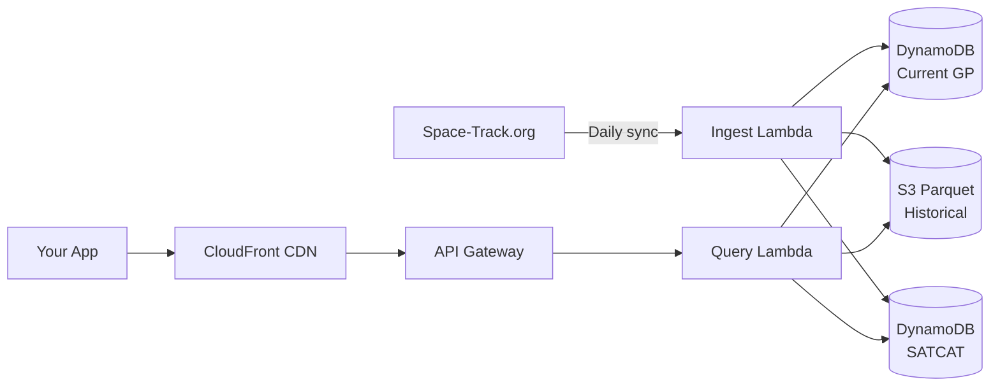

# Architecture

A brief overview of how the Orbital Data API works. We share this for transparency — the API is community infrastructure, and you should know what's under the hood.

## High-level design

## Components

### Storage

- **S3 (Parquet)**: Historical element sets stored as Parquet files, partitioned by NORAD ID and date. Enables efficient time-range queries over ~170M records.
- **DynamoDB**: Two tables — `gp-current` holds the latest element set per satellite for fast lookups, and `satcat` holds satellite catalog metadata.

### Compute

- **API Gateway**: REST API with usage plans, API key validation, and throttling.
- **Lambda functions**: Stateless query handlers that read from DynamoDB (current data) or S3 (historical data). Scales automatically with request volume.
- **Ingest Lambda**: Daily scheduled function that syncs new GP records from Space-Track.org into S3 and DynamoDB.

### Edge

- **CloudFront CDN**: Caches responses at the edge. Current GP data is cached with short TTLs (minutes); historical data is cached longer since it's immutable.

## Infrastructure as Code

The entire stack is defined in AWS CDK (Python) and deployed across five stacks: Storage, Auth, Compute, API, and Ingest. The infrastructure code is in the [private API repository](https://github.com/orbital-data/api).
